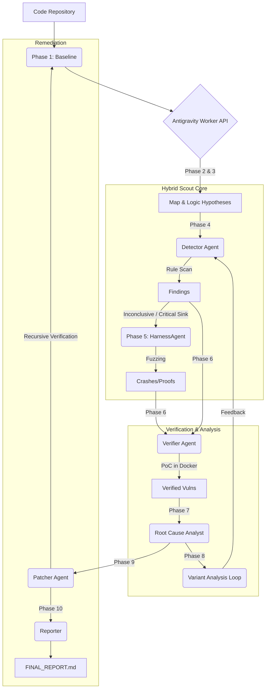

# ZeroKit2 Architecture (v5.1)

> **Autonomous Security Research Pipeline**
> A deterministic pipeline powered by intelligent agents and LLM logical reasoning.

---

The system follows a **10-Phase Agentic Hunt Protocol**, where intelligence is consolidated into the **Antigravity Worker API** and verification is bolstered by a **Fuzzing (Pillar 2)** layer.



---

## 🧩 Core Components

### 1. The Brain: LLM Gateway
The central intelligence unit that powers all "Thinking" agents.
*   **Location**: `.agent/pipeline/services/llm_gateway.py`
*   **Role**: Manages prompt engineering, token budgeting, and provider interaction (Google Gemini Pro).

### 2. The Agents (Autonomous Entities)
Agents are Python classes that combine deterministic tools with LLM reasoning.

| Agent/API | Internal Class | Responsibility | Key Tools |
| :--- | :--- | :--- | :--- |
| **Antigravity API** | `WorkerAPI` | Universal Mapping, Deep Logic & CWE/CVSS | `LLM Gateway`, `CWE Skill` |
| **HarnessAgent** | `HarnessAgent` | Generates fuzzer harnesses (AFL++, Atheris) | `LLM Gateway`, `Fuzzing Infrastructure` |
| **Detector** | `Detector` | Orchestrates Hybrid Scout (Semgrep + CodeQL + Joern) | `SemgrepRunner`, `CodeQLRunner`, `JoernRunner` |
| **Verifier** | `Verifier` | The "Proof Engine". Writes and runs PoCs. | `DockerSandbox`, `SystematicDebugging` |
| **Root Cause** | `RootCauseAnalyst` | Analyzes code to find the exact line responsible. | `LLM Gateway` |
| **Patcher** | `Patcher` | Generates and verifies code fixes. | `UnifiedDiff`, `run_project_poc` |

### 3. Stability & Error Handling
*   **Worker API Fallback**: If the system cannot identify a framework, it switches to `GenericAdapter` logic to ensure *some* analysis is performed (text/code scanning).
*   **Partial Context Logging**: `Detector` logs `PARTIAL_CONTEXT` warnings if file parsing fails, allowing `RootCauseAnalyst` to investigate missing data.
*   **State Management**: `StateManager` tracks differential analysis to avoid rescanning unchanged files.

---

## 🔄 Intelligent Loops (The "Magic")

### 1. Detection Loop (Self-Healing)
*   **Trigger**: Semgrep rule syntax error.
*   **Logic**: `Detector` sends the error + broken rule to the LLM. LLM returns a fixed rule. `Detector` retries.

### 2. Verification Loop (Strategy Iteration)
*   **Trigger**: PoC execution failed (Exit Code != 0).
*   **Logic**: `Verifier` switches strategy (e.g., from `Standard` to `Obfuscated` or `Timing-Based`) and regenerates the PoC.

### 3. Feedback Loop (Variant Analysis)
*   **Trigger**: Vulnerability Verified.
*   **Logic**: `Orchestrator` extracts the abstract pattern of the verified bug and instructs `Detector` to scan for *variants* across the entire codebase.

---

## 📂 Directory Structure

```text
.agent/
├── pipeline/
│   ├── adapters/       # Language-specific & Generic adapters
│   ├── agents/         # Intelligence (Detector, Verifier, etc.)
│   ├── tools/          # Tool Wrappers (Semgrep, CodeQL, Joern)
│   ├── services/       # LLM Gateway, State Manager
│   └── orchestrator.py # Main Pipeline Logic
├── rules/              # Semgrep Rules & Templates
├── skills/             # Agent Skills (Brainstorming, Debugging)
└── workspaces/         # Temporary scanning artifacts
```
