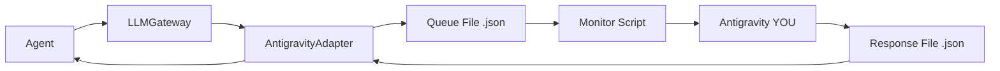

# Antigravity Integration Guide

## Overview

ZeroKit2 can be powered by **Antigravity** (this AI assistant) instead of external APIs. This provides better context awareness, zero external dependencies, and complete control over the LLM pipeline.

## Architecture



## Setup

### 1. Configuration

Create `.env` file (or use `.env.example`):

```bash
LLM_PROVIDER=antigravity
ANTIGRAVITY_TIMEOUT=60
ENABLE_GEMINI_FALLBACK=true  # Optional safety net
```

### 2. Start Monitor

```bash
python .agent/scripts/antigravity_monitor.py
```

Options:
- `--auto-all`: Auto-execute ALL prompts (useful for batch processing)

### 3. Run Pipeline

In a separate terminal:

```bash
python hunt_pipeline.py <target_directory>
```

## Workflow

### Auto-Execute Methods (Routine Tasks)

These run automatically after 2-second delay:
- `fix_semgrep_rule` - Fixing broken Semgrep rules
- `fix_rule` - Alias for above

**Cancel auto-execution**: Press `Ctrl+C` during the 2-second countdown

### Manual Review Methods (Critical Tasks)

These require explicit confirmation:
- `generate_hypotheses` / `analyze_risk` - Threat modeling
- `generate_patch` - Code fixes
- `generate_poc` - Exploit generation
- `analyze_root_cause` - RCA analysis

### Response Format

When prompted, provide your response and end with:
```
---END---
```

Example:
```
Your response here...
Multiple lines are supported.
---END---
```

## Data Archival

All prompt-response pairs are automatically archived to:
```
.agent/prompts/archive/<request-id>.json
```

This creates a valuable dataset for:
- Fine-tuning prompts
- Analyzing agent behavior
- Debugging issues
- Training future models

## Fallback to Gemini

If Antigravity times out (default: 60s), the system will:

1. Log a warning
2. Ask if you want to continue with Gemini API
3. Use Gemini if `ENABLE_GEMINI_FALLBACK=true` and `GOOGLE_API_KEY` is set
4. Fail gracefully otherwise

To disable fallback:
```bash
ENABLE_GEMINI_FALLBACK=false
```

## Troubleshooting

### Monitor not detecting files

**Problem**: Queue files created but monitor doesn't respond

**Solution**:
- Check monitor is running in correct directory
- Verify watchdog installed: `pip install watchdog`
- Check file permissions

### Timeout errors

**Problem**: `AntigravityNotAvailableError` after 60s

**Solution**:
- Ensure monitor script is running
- Check for typos in response (must end with `---END---`)
- Increase timeout: `ANTIGRAVITY_TIMEOUT=120`

### Empty responses

**Problem**: Pipeline receives empty response

**Solution**:
- Always end response with `---END---`
- Don't send empty lines only
- Check response file was created in correct directory

## Advanced Configuration

### Custom Auto-Execute Rules

Edit `.agent/scripts/antigravity_monitor.py`:

```python
AUTO_EXECUTE_METHODS = {
    "fix_rule",
    "fix_semgrep_rule",
    "your_custom_method",  # Add here
}
```

### Integration with CI/CD

For automated pipelines:

```bash
# Pre-create responses for known prompts
# Then run with timeout disabled
ANTIGRAVITY_TIMEOUT=0 python hunt_pipeline.py <target>
```

### Dataset Analysis

Analyze archived conversations:

```python
import json
from pathlib import Path

archives = Path(".agent/prompts/archive").glob("*.json")
for archive in archives:
    with open(archive) as f:
        data = json.load(f)
        print(f"Agent: {data['request']['agent']}")
        print(f"Method: {data['request']['method']}")
        print(f"Tokens: {data['response']['usage']}")
```

## Security Considerations

- **Archive Privacy**: Archive files contain all prompts/responses. Add to `.gitignore` if sensitive.
- **Manual Review**: Always review `generate_patch` and `generate_poc` outputs before applying.
- **Timeout Safety**: System will halt rather than proceed with unverified responses.

## Performance Tips

1. **Batch Processing**: Use `--auto-all` for known-safe codebases
2. **Parallel Tasks**: Monitor can handle multiple queue files simultaneously
3. **Response Time**: Aim for <30s responses to avoid timeout warnings
