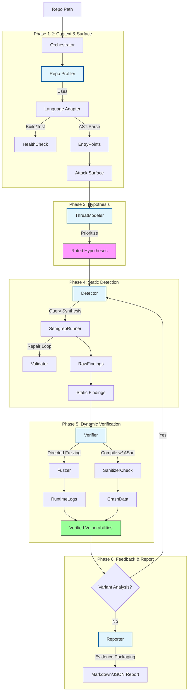

# ZeroKit2 Security Pipeline Architecture

## High-Level Data Flow

## Component Breakdown

1.  **Orchestrator (`orchestrator.py`)**:
    *   Manages the lifecycle using `PipelineContext`.
    *   Enforces the **Verification Gate**: Only `CONFIRMED` vulnerabilities pass to the Reporter.

2.  **Repo Profiler (`profiler.py` + `adapters/`)**:
    *   **Smart Detection**: Identifies language (Python/Java/Go) and build system (Maven/Pip).
    *   **Health Check**: Runs build/test commands to establish a baseline.
    *   **Attack Surface**: Maps API endpoints (HTTP) and CLI inputs.

3.  **Threat Modeler (`threat_modeler.py`)**:
    *   **Prioritization**: Ranks entry points (CRITICAL, HIGH, MEDIUM, LOW) based on keywords (`admin`, `auth`) and exposure (`HTTP`).

4.  **Detector (`detector.py` + `tools/semgrep_runner.py`)**:
    *   **Static Scanning**: Wraps Semgrep.
    *   **Repair Loop**: Ready to handle syntax errors in generated queries.

5.  **Verifier (`verifier.py`)**:
    *   **Directed Verification**: Targets specific code locations found by Detector.
    *   **Sanitizer Integration**: Simulates checking for AddressSanitizer (ASan) crashes to catch memory errors.

6.  **Reporter (`reporter.py`)**:
    *   **Evidence Packaging**: Includes PoC, Stack Traces, and Static Traces in the final report.
    *   **Variant Analysis**: The Loop triggers a re-scan for verified patterns.
